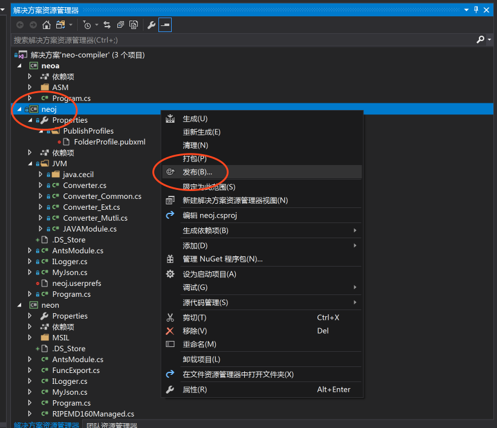

# NEO 智能合约 JAVA 开发环境搭建

本文介绍如何在Windows环境搭建NEO智能合约JAVA环境，本文使用的系统是Win7 SP1，其余版本可以做相应调整。

## 开发工具

1. JDK 安装

- [JDK](http://www.oracle.com/technetwork/java/javase/downloads/jdk8-downloads-2133151.html) 下载安装及配置环境变量请查阅相关文档。

2. 开发工具

- [IntellJ IDEA](https://www.jetbrains.com/idea/) 用于编写JAVA智能合约代码

- [Visual Studio 2017](https://www.visualstudio.com/downloads/) 用于编译 NeoContract 的编译器

## 智能合约 JAVA 编译器

[neo-compiler](https://github.com/neo-project/neo-compiler) 是 NeoContract 的编译器，可以将高级语言的代码编译为智能合约的指令。其中 neoj 项目是 NeoContract 的 JAVA 编译器。


在 Github 下载 [neo-compiler](https://github.com/neo-project/neo-compiler) 项目，用 Visual Studio 2017 打开该解决方案，发布其中的 neoj 项目，如图所示。



正常情况下发布成功之后会在`neo-compiler\neoj\bin\Release\PublishOutput`目录下生成neoj.exe文件，如果出现`无法复制文件"obj\Release\netcoreapp1.1\win10-64\neoj.dll"`错误信息提示，可以在`obj\Release\netcoreapp1.1\`目录找到`neoj.dll`文件复制进去。


发布完成之后可以将neoj.exe所在的路径追加到环境变量PATH中，以保证在任何地方都能直接执行neoj.exe，在终端里直接执行neoj.exe后出现如下提示表示发布出来的结果正常。

```
Neo.Compiler.JVM console app v2.0.3.0
need one param for .class filename.
```

在 Windows7 SP1 系统中如果出现提示缺少 `api-ms-win-core-console-l2-1-0.dll` 文件。可在 [这里](https://cn.dll-files.com/api-ms-win-core-console-l2-1-0.dll.html) 下载该文件，下载后解压出 `api-ms-win-core-console-l2-1-0.dll` 文件，放在 neoj.exe 所在的目录中。

如果仍然失败，可以尝试在终端中执行如下publish命令生成neoj.exe

```bash
cd neo-compiler
dotnet publish -r win10-x64 -c release

# 执行以下命令获得最大的兼容性
dotnet publish -r win7-x86 -c debug
```

## 智能合约框架

在编写 JAVA 智能合约时，需要引用 framework 中的代码，所以需要获取该代码添加到自己的工程中。从 Github 下载 maven 工程[neo-devpack-java](https://github.com/neo-project/neo-devpack-java)，可以用 maven 打包生成 jar 包，将 target 中生成的`neo-devpack-java-2.3.0.jar`重命名为`org.neo.smartcontract.framework.jar`，重命名的原因在后面会有解释说明。

## 创建智能合约项目

利用 IDEA 开发工具可以很方便的创建自己的 JAVA 工程，你也可以直接 clone 本项目代码作为自己开发项目，然后在 `Project Settings -> Libraries -> New Project Library` 将上一步生成的 `org.neo.smartcontract.framework.jar` 添加到项目中。

开始书写第一个 HelloWorld.java 代码，示例如下：

```java
package org.neo.contractsample.helloworld;

import org.neo.smartcontract.framework.SmartContract;
import org.neo.smartcontract.framework.services.neo.Storage;

/**
 * Created by zlh on 09/11/2017.
 */
public class HelloWorld extends SmartContract {

    public static void Main(String[] args) {
        Storage.put(Storage.currentContext(), "Hello", "World");
    }
    
}

```

在 IDEA 中点击`Build -> Build Project` 就可以生成 HelloWorld.class 文件。

## 编译生成智能合约文件

在终端进入上一步 HelloWorld.class 文件的目录下执行命令即可得到 HelloWorld.avm 文件。

```bash
# 输入
neoj.exe HelloWorld.class

# 输出
Neo.Compiler.JVM console app v2.0.3.0
找到函数入口点org.neo.neweconolab.contract.HelloWorld::Main
convert succ
write:HelloWorld.avm
SUCC

```

如果提示 `Convert Error:System.IO.FileNotFoundException: Could not find file 'neo-compiler\neoj\bin\Debug\netcoreapp1.1\win7-x86\org.neo.smartcontract.framework.jar'.
` 错误信息，则需要手动将之前生成好的 `org.neo.smartcontract.framework.jar` 放至此处，这也是为什么上一步中需要将 maven 打包生成 jar 包重命名的原因。

至此则完成了 NEO 智能合约 JAVA 开发环境的搭建。

